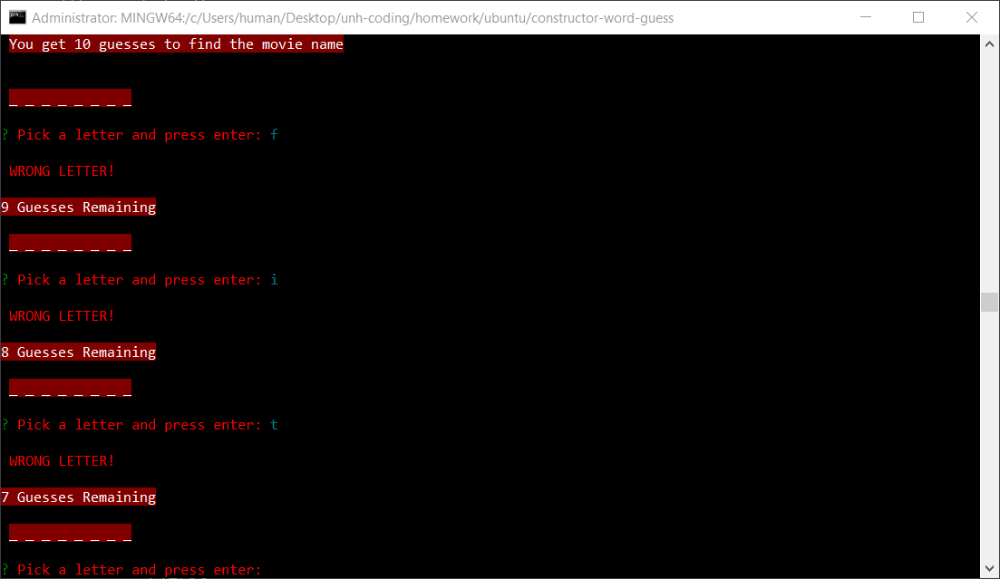

# Constructor Word Guess 
## Using CLI

* **Game Information**: This is a node.js application that uses the prompts and the command-line. Try and guess the movie names! 

### To Play
1. Clone the repo to a spot on your CPU where you want it.
2. Go to the directory with the .vagrantfile
3. run `vagrant up` on command line
4. run `vagrant ssh`
5. cd /var/code
6. Run `NPM install`
7. On CLI type node index.js to begin

### Technologies Used
* Node.js
* JavaScript
* NPM inquirer
* NPM chalk
* NPM figlet

#### Screenshot

### Author

####  Joshua LeBoeuf
